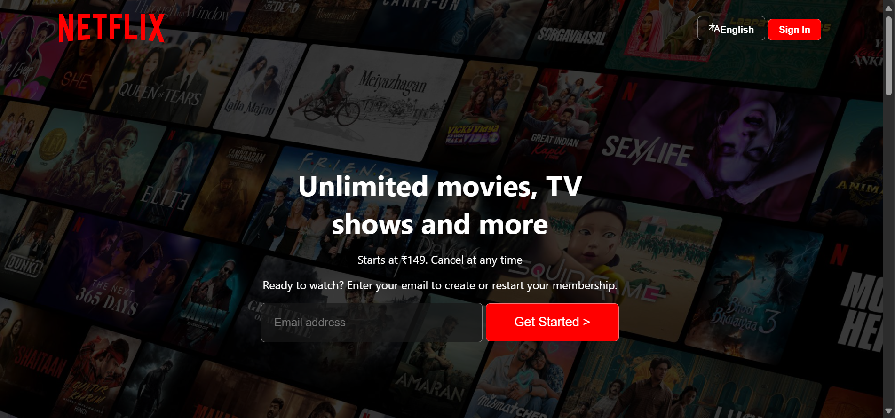
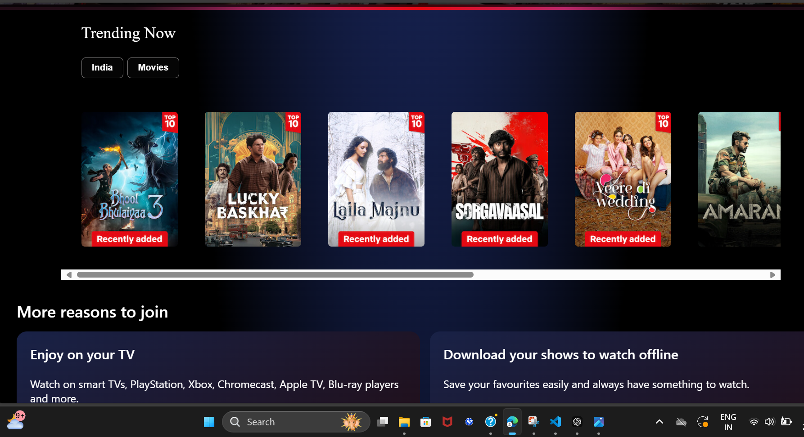

# 🎬 Netflix Clone  

A **Netflix Clone Web Application** built using **HTML, CSS, and JavaScript** that replicates the look and feel of the Netflix streaming platform.  
This project focuses on creating a responsive and interactive UI similar to Netflix to enhance frontend development skills.  

---

## 📸 Demo  

### 🔹 Screenshots
<p align="center">
  
  
</p>


## 🎬 Demo
<p align="center">
  
</p>


---

## 🚀 Features   

- 🎥 Netflix-like **Home Page UI**  
- 📱 Fully **Responsive Design** (Mobile, Tablet, Desktop)  
- 🖼️ Movie posters and banners styled like Netflix  
- 🎬 Hover effects for movie cards  
- 📂 Clean and structured project files  
- ⚡ Fast and lightweight frontend project  

---

## 🛠️ Tech Stack  

- **HTML5** – Structure  
- **CSS3** – Styling and Layout  
- **JavaScript (ES6)** – Interactivity  

---

## 📥 Installation & Setup  

Follow these steps to download and run the project locally 👇  

```bash
# 1️⃣ Clone the repository
git clone https://github.com/Jagtap-Srushti/Netflix-Clone.git

# 2️⃣ Navigate to the project folder
cd Netflix-Clone

# 3️⃣ Open the index.html file in your browser
